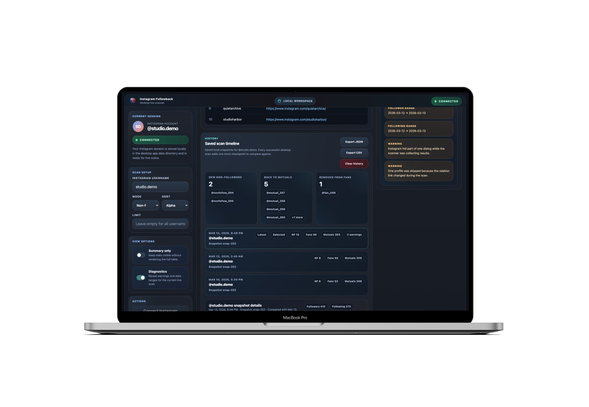
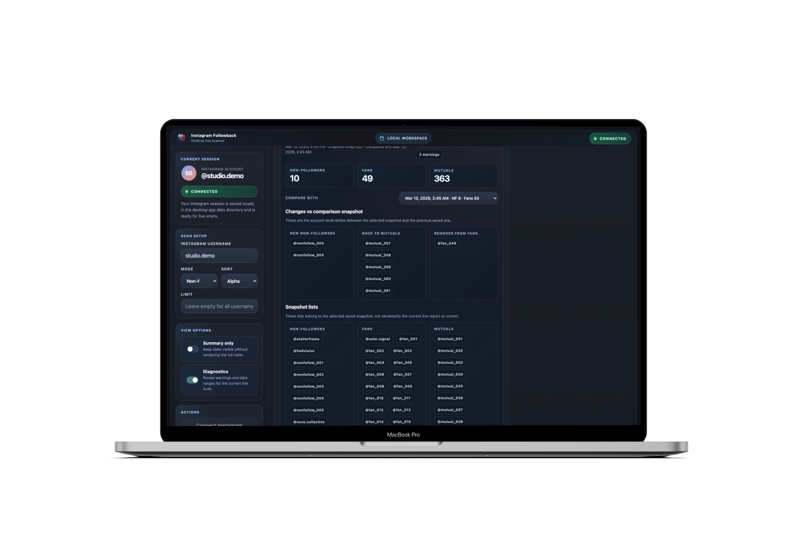

# Instagram Followback

<p align="center">
  
</p>

<p align="center">
  <strong>Local-first desktop app for reviewing Instagram non-followers, fans, mutuals, and scan history.</strong>
</p>

<p align="center">
  Built for people who want a clear, repeatable workflow on their own machine, without uploading account data to a hosted service.
</p>

<p align="center">
  <a href="https://github.com/theycallmedern/instagram-followback-checker/releases/latest"></a><a href="https://github.com/theycallmedern/instagram-followback-checker/actions/workflows/desktop-build.yml"></a><a href="./LICENSE"></a><a href="./SECURITY.md"></a>
</p>

<p align="center">
  <code>Tauri desktop app</code>
  <code>Local session storage</code>
  <code>Live scans</code>
  <code>History snapshots</code>
  <code>JSON / CSV export</code>
</p>

## Overview

Instagram Followback is a local analysis tool for understanding your Instagram relationship graph through a desktop-first workflow.

The app connects to a real Instagram session, runs a local scan, and presents the results in one workspace: non-followers, fans, mutuals, diagnostics, search, and saved scan history.

It is designed for people who want a cleaner alternative to ad-heavy web tools, repeated export imports, or one-off scripts that are hard to trust or reuse.

> [!IMPORTANT]
> The default product flow is local-first. The desktop app, saved session, reports, and history snapshots stay on your machine unless you explicitly export data yourself.

### Why it exists

Most followback tools trade away clarity in one of two ways: they either rely on static export files, or they ask you to trust a hosted service with account access and session data.

Instagram Followback takes a simpler approach:

- keep the session and reports on your machine
- make current scans easy to run and review
- preserve a usable desktop workflow between sessions
- provide browser and CLI fallbacks for people who prefer them

## Key Features

- **Desktop-first workflow**: connect once, scan locally, review results in a persistent workspace.
- **Relationship views that matter**: switch between `Non-followers`, `Fans`, and `Mutuals`.
- **Saved scan history**: automatically store local snapshots after successful scans.
- **Snapshot comparison**: inspect what changed between the latest scan and a previous snapshot.
- **Inspector and diagnostics**: verify a single username and review warnings or scan metadata when needed.
- **Export support**: export saved history as `JSON` or `CSV`.
- **Session reuse**: keep a local Instagram session between runs instead of logging in every time.
- **Additional local interfaces**: use the browser UI or CLI when the desktop app is not the right fit.

## Product Preview

> [!NOTE]
> The screenshots below are synthetic captures generated from demo data. They do not contain real account data.

<p align="center">
  
</p>

<p align="center">
  <strong>Main workspace for local scanning, filtering, review, and diagnostics</strong>
</p>

<p align="center">
  
</p>

<p align="center">
  <strong>Saved scan timeline with local deltas and export controls</strong>
</p>

<p align="center">
  
</p>

<p align="center">
  <strong>Snapshot detail view with comparison and per-scan lists</strong>
</p>

## Tech Stack

| Layer | Technology |
| --- | --- |
| Desktop shell | Tauri 2 |
| Desktop backend | Rust |
| Scan engine | Python |
| Browser automation | Playwright |
| Desktop UI | Static HTML, CSS, and JavaScript |
| Packaging | Tauri bundles for macOS and Windows |

## Getting Started

### Install the released app

If you want the packaged desktop app, start with the latest GitHub release.

> [!TIP]
> If you only want to use the product, install from GitHub Releases instead of building from source.

- Latest release: `https://github.com/theycallmedern/instagram-followback-checker/releases/latest`
- All releases: `https://github.com/theycallmedern/instagram-followback-checker/releases`
- Download for macOS: [latest `.dmg`](https://github.com/theycallmedern/instagram-followback-checker/releases/latest)
- Download for Windows: [latest installer `.exe`](https://github.com/theycallmedern/instagram-followback-checker/releases/latest)

**macOS**

1. Download the latest `.dmg`.
2. Move `Instagram Followback.app` to `/Applications`.
3. Launch the app and click `Connect Instagram`.

**Windows**

1. Download the latest installer `.exe`.
2. Run the installer.
3. Launch the app and click `Connect Instagram`.

### Run from source

#### Prerequisites

- Python `3.9+`
- Node.js and npm
- Rust and Cargo
- macOS or Windows recommended for desktop packaging

> [!NOTE]
> `desktop:build-windows` is intended for a Windows host. If you do not have one locally, use the GitHub Actions desktop workflow to produce Windows artifacts.

#### Installation

```bash
npm install
python -m pip install ".[live]"
```

#### Prepare the bundled desktop runtime

```bash
npm run desktop:prepare-runtime
```

#### Run the desktop app in development

```bash
npm run desktop:dev
```

#### Build production bundles

```bash
npm run desktop:build
```

Additional build targets:

```bash
npm run desktop:build-app
npm run desktop:build-dmg
npm run desktop:build-windows
npm run desktop:install
```

### Alternative local interfaces

The repository also includes a browser UI and CLI.

**Browser UI**

```bash
python3 instagram_followback_web.py
```

Then open:

```text
http://127.0.0.1:8000
```

**CLI**

```bash
ig-followback-live --login-only
ig-followback-live
ig-followback /path/to/instagram-export.zip
```

## Usage

### Desktop workflow

1. Open the app and click `Connect Instagram`.
2. Complete login in the visible Instagram browser window if Instagram requires it.
3. Return to the desktop app.
4. Click `Run scan`.
5. Review the current relationship view in `Non-followers`, `Fans`, or `Mutuals`.
6. Use `Inspector` to check a specific username.
7. Open `Diagnostics` when you want to review warnings or scan metadata.
8. Use `Saved scan timeline` to compare scans, export history, or inspect snapshot details.

### What gets stored

After a successful scan, the desktop app can keep:

- the saved local Instagram session
- the latest report used to restore the workspace on restart
- history snapshots for that account
- optional exported history files when you explicitly export them

> [!NOTE]
> This is what allows the app to reopen with the latest saved snapshot already visible instead of starting from an empty workspace every time.

## Project Structure

| Path | Purpose |
| --- | --- |
| [`desktop-shell/index.html`](./desktop-shell/index.html) | Main desktop interface rendered by Tauri |
| [`src-tauri/src/main.rs`](./src-tauri/src/main.rs) | Tauri commands and bridge orchestration |
| [`src-tauri/tauri.conf.json`](./src-tauri/tauri.conf.json) | Desktop app configuration and bundle resources |
| [`instagram_followback_desktop_bridge.py`](./instagram_followback_desktop_bridge.py) | Python bridge used by the desktop app |
| [`instagram_followback_live.py`](./instagram_followback_live.py) | Live Instagram session and scan engine |
| [`instagram_followback_web.py`](./instagram_followback_web.py) | Local browser UI |
| [`instagram_followback_checker.py`](./instagram_followback_checker.py) | Export-based CLI analyzer |
| [`scripts/prepare_desktop_runtime.py`](./scripts/prepare_desktop_runtime.py) | Builds the bundled Python runtime for desktop releases |
| [`scripts/capture_desktop_screenshots.py`](./scripts/capture_desktop_screenshots.py) | Generates synthetic screenshots for documentation |
| [`tests/`](./tests) | Automated test coverage for core flows |

## Privacy and Security

Instagram Followback is intentionally local-first.

- There is no hosted backend in the default product flow.
- Your Instagram session is stored locally on your machine.
- Reports and history snapshots remain local unless you export them yourself.
- `Disconnect` clears the saved desktop session.
- Repository screenshots use synthetic demo data, not real account data.

> [!WARNING]
> This project interacts with a real Instagram session in your local browser environment. Review the code, use a machine you trust, and avoid running modified builds from untrusted sources.

For security expectations and reporting guidance, see [SECURITY.md](./SECURITY.md).

## Development

### Test suite

```bash
python3 -m unittest \
  tests.test_instagram_nonfollowers \
  tests.test_instagram_followback_live \
  tests.test_instagram_followback_desktop_bridge \
  -v
```

### Python syntax check

```bash
python3 -m py_compile \
  instagram_followback_web.py \
  instagram_followback_live.py \
  instagram_followback_checker.py \
  instagram_followback_desktop_bridge.py \
  scripts/prepare_desktop_runtime.py \
  scripts/capture_desktop_screenshots.py
```

### Rust desktop backend check

```bash
cargo check --manifest-path src-tauri/Cargo.toml
```

### Refresh documentation screenshots

```bash
python3 scripts/capture_desktop_screenshots.py
```

> [!TIP]
> The repository screenshots are generated from synthetic demo state so the documentation can stay realistic without exposing real account data.

## Contributing

Contributions are welcome.

If you plan to make a significant change, open an issue or start a discussion first so the implementation can stay aligned with the product direction and local-first constraints.

When contributing:

- keep changes scoped and reviewable
- preserve local-first behavior unless a change explicitly requires otherwise
- include tests or a clear verification path for behavior changes
- update documentation when user-facing behavior changes

## License

This project is licensed under the [MIT License](./LICENSE).
