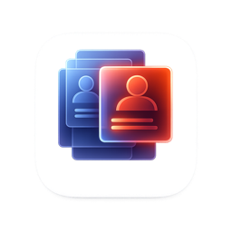
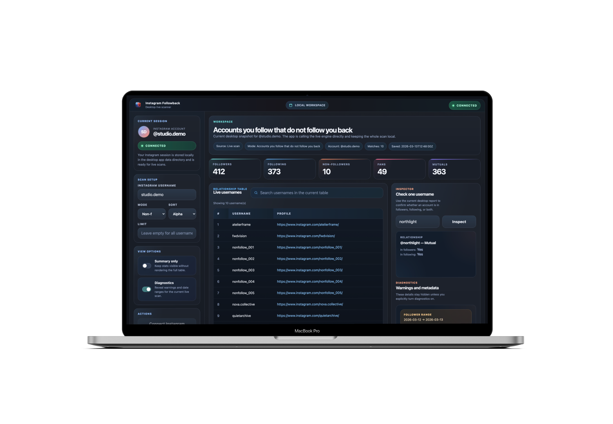

<h1 align="center">
  
  Instagram Followback
</h1>

<p align="center">
  <strong>Local-first desktop app for understanding your Instagram relationship graph with a clean, modern workflow.</strong>
</p>

<p align="center">
  <a href="https://github.com/theycallmedern/instagram-followback-checker/releases/latest"></a><a href="https://github.com/theycallmedern/instagram-followback-checker/actions/workflows/desktop-build.yml"></a><a href="./SECURITY.md"></a><a href="./LICENSE"></a>
</p>

It is designed around one strong loop:

- connect a real Instagram session once
- run a live scan in the background
- review non-followers, fans, mutuals, diagnostics, and search results in one polished desktop workspace

No cloud backend. No hosted dashboards. No account export ritual every time you want a current answer.

> [!IMPORTANT]
> Instagram Followback is a local product. The desktop app, the saved session, and the analysis flow stay on your machine.

## Why It Feels Different

Most followback tools feel temporary. They are noisy, brittle, or vague about where your session and data actually go.

Instagram Followback takes the opposite approach:

- desktop-first product experience instead of a throwaway script
- local session storage on your own machine
- current live data from a real logged-in Instagram session
- background scanning after the session is connected
- browser UI and CLI fallbacks for people who still want them

The result is a tool that feels less like a hack and more like a serious local product.

## Product Snapshot

### What you get

- native Tauri desktop shell with polished macOS and Windows release builds
- bundled Python runtime for desktop release builds
- reusable local Instagram session between runs
- session status with connected account identity and cached avatar
- background live scans by default after connection
- relationship modes for `Non-followers`, `Fans`, and `Mutuals`
- fast search, one-account inspector, and optional diagnostics
- local-only workflow with no hosted API requirement

### What stays private

- the live browser session stays on your machine
- reports remain local unless you choose to export them
- `Disconnect` removes the saved desktop session
- repository screenshots are synthetic and contain no real account data

## Screenshots

> [!NOTE]
> The screenshot below is a synthetic product capture generated from the desktop UI. It does not contain real account data.

<p align="center">
  
  <br />
  <strong>One local workspace for connection, scanning, and review</strong>
</p>

## Desktop Quick Start

### Install the released app

> [!TIP]
> If you just want the desktop product, start from GitHub Releases instead of building from source.

If you just want to use the desktop product, download the latest release from GitHub Releases and install the bundle for your platform:

- download for macOS [here](https://github.com/theycallmedern/instagram-followback-checker/releases/latest)
- download for Windows [here](https://github.com/theycallmedern/instagram-followback-checker/releases/download/v0.3.1/Instagram.Followback_0.3.1_x64-setup.exe)
- open `Releases`: `https://github.com/theycallmedern/instagram-followback-checker/releases`
- on macOS, download the latest `.dmg`, move `Instagram Followback.app` into `/Applications`, and launch it
- on Windows, download the latest installer `.exe` from the same release and run the setup flow
- open the app and click `Connect Instagram`

### Run from source

If you are developing locally or building the desktop app yourself:

#### Requirements

- macOS or Windows
- Python `3.9+`
- Node.js and npm
- Rust and Cargo

#### Install dependencies

```bash
npm install
python -m pip install ".[live]"
```

#### Prepare the bundled runtime

```bash
npm run desktop:prepare-runtime
```

#### Start the desktop app in development

```bash
npm run desktop:dev
```

#### Build the desktop bundle

```bash
npm run desktop:build
```

For macOS development, you can also install the app into `/Applications`:

```bash
npm run desktop:install
```

For Windows development on a Windows host, build the installer bundle with:

```bash
npm run desktop:build-windows
```

If you do not have access to a Windows machine, use the GitHub Actions desktop workflow to generate Windows artifacts on `windows-latest`.

## Daily Flow

1. Click `Connect Instagram`
2. Finish login in the visible Instagram browser window if Instagram asks for it
3. Return to the desktop app
4. Click `Run scan`
5. Review `Non-followers`, `Fans`, `Mutuals`, `Inspector`, and `Diagnostics`

After the session is connected, scans run in the background by default.

If Instagram asks for login again later, reconnect once and continue.

> [!NOTE]
> The desktop app can attach the saved local session first and resolve the account name and avatar immediately after. That is expected behavior for the current desktop flow.

## Browser And CLI Fallbacks

The repository still ships two additional local interfaces for people who prefer them.

### Browser UI

```bash
python3 instagram_followback_web.py
```

Then open:

```text
http://127.0.0.1:8000
```

### CLI

Save a live session only:

```bash
ig-followback-live --login-only
```

Run a live scan:

```bash
ig-followback-live
```

Run the export-based analyzer:

```bash
ig-followback /path/to/instagram-export.zip
```

## Command Reference

### Desktop commands

```bash
npm run desktop:dev
npm run desktop:build
npm run desktop:build-app
npm run desktop:build-dmg
npm run desktop:build-windows
npm run desktop:release
npm run desktop:install
```

### Python commands

```bash
ig-followback-ui
ig-followback-live
ig-followback
```

## Project Structure

| File | Responsibility |
| --- | --- |
| [`desktop-shell/index.html`](./desktop-shell/index.html) | Desktop UI rendered by Tauri |
| [`src-tauri/src/main.rs`](./src-tauri/src/main.rs) | Desktop commands, process orchestration, and runtime integration |
| [`src-tauri/tauri.conf.json`](./src-tauri/tauri.conf.json) | Tauri app configuration and bundle resources |
| [`instagram_followback_desktop_bridge.py`](./instagram_followback_desktop_bridge.py) | Python bridge used by the desktop app |
| [`instagram_followback_live.py`](./instagram_followback_live.py) | Live Instagram session handling, connection flow, and scanning |
| [`instagram_followback_web.py`](./instagram_followback_web.py) | Browser-based local UI |
| [`instagram_followback_checker.py`](./instagram_followback_checker.py) | Export-based followback analyzer |
| [`scripts/prepare_desktop_runtime.py`](./scripts/prepare_desktop_runtime.py) | Builds the bundled Python runtime for desktop release builds |
| [`scripts/capture_desktop_screenshots.py`](./scripts/capture_desktop_screenshots.py) | Generates the synthetic desktop screenshots used in the docs |

## Development

Run tests:

```bash
python3 -m unittest tests.test_instagram_nonfollowers tests.test_instagram_followback_live tests.test_instagram_followback_desktop_bridge -v
```

Run a quick Python syntax check:

```bash
python3 -m py_compile instagram_followback_web.py instagram_followback_live.py instagram_followback_checker.py instagram_followback_desktop_bridge.py scripts/prepare_desktop_runtime.py scripts/capture_desktop_screenshots.py
```

Check the desktop backend:

```bash
cargo check --manifest-path src-tauri/Cargo.toml
```

Refresh the documentation screenshots:

```bash
python3 scripts/capture_desktop_screenshots.py
```

## Security

See [`SECURITY.md`](./SECURITY.md) for session-handling guidance, sensitive data rules, and responsible disclosure notes.

## Changelog

See [`CHANGELOG.md`](./CHANGELOG.md) for release history.

## License

MIT
