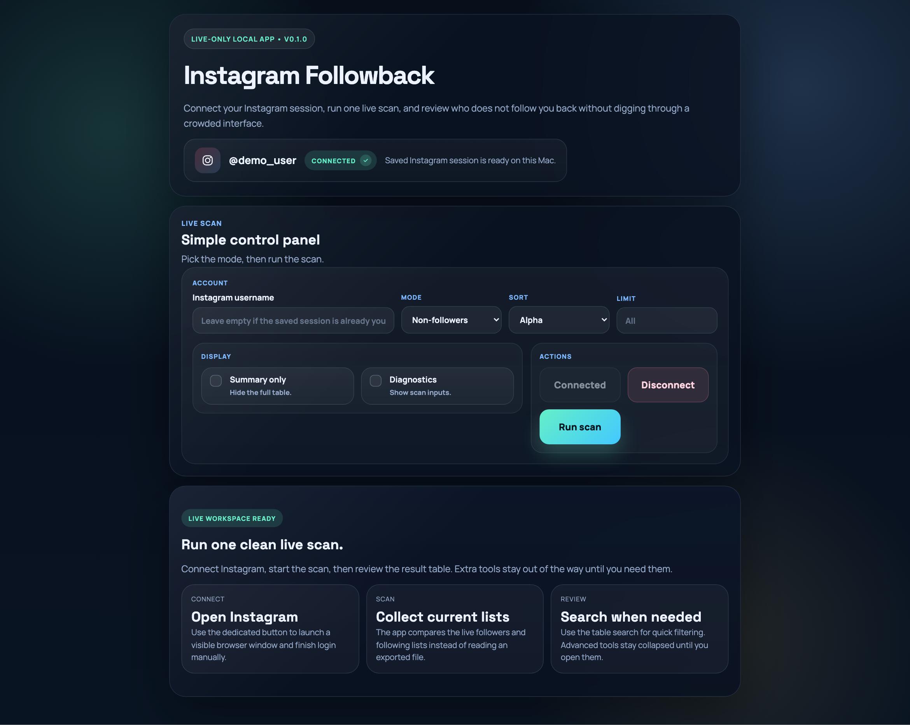
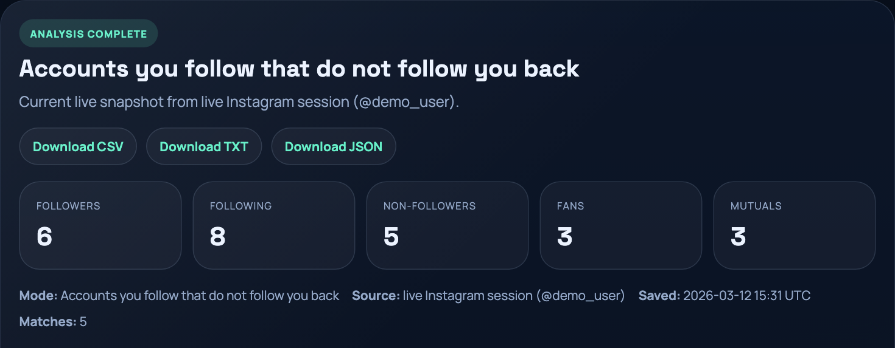

# Instagram Followback

A fast, production-style local app for checking Instagram followback relationships.

It is built as a local-first web interface with a Playwright-powered live scanner and is designed for one job: make Instagram followback checks clean, private, and actually usable.

## Overview

Instagram Followback gives you a cleaner alternative to browser extensions, random web tools, or fragile scripts.

With the app, users can:

- connect a real local Instagram session
- run a live scan of current `followers` and `following`
- check `Non-followers`, `Fans`, and `Mutuals`
- search usernames inside the results table
- inspect one username against the latest scan
- keep an ignore list for noisy accounts
- save local scan history and compare changes
- export reports as `CSV`, `TXT`, and `JSON`
- disconnect and delete the saved local session in one click

The project keeps the runtime simple:

- the live browser session is stored locally on the machine
- the web UI runs on `127.0.0.1`
- no unofficial Instagram API is required
- the original export-based CLI is still included for offline workflows

## App

Local app: **Instagram Followback**

Users can run it locally and keep the entire live-session flow on their own machine.

Current release: [`v0.2.0`](../../releases/tag/v0.2.0)

## Preview

### Core experience

The main flow is built for one clean loop: connect Instagram once, run a live scan, and review the result table without terminal prompts or clutter.

<table>
  <tr>
    <td align="center">
      
      <br />
      <strong>Connect and launch a clean live scan</strong>
    </td>
    <td align="center">
      
      <br />
      <strong>Review stats and usernames in one place</strong>
    </td>
  </tr>
</table>

### Workflow focus

The app is intentionally narrow and focused.

It is optimized for:

- current live account state
- one-click result review
- local privacy by default
- lightweight controls instead of overloaded settings

## Highlights

- built around a **live local web UI**
- **Playwright** scanner with visible browser flow
- local session connect / disconnect model
- `Non-followers`, `Fans`, and `Mutuals` modes
- in-browser search, inspect, ignore list, and history
- `CSV`, `TXT`, and `JSON` downloads
- export-based CLI still available for archive workflows
- test coverage for parser, web bundle, and live-session helpers

## User Features

### Live scan

- connect Instagram through a visible browser window
- reuse a saved local session on the next run
- run a fresh live scan without terminal prompts
- disconnect and wipe the saved session

### Result review

- `Non-followers` - accounts you follow that do not follow you back
- `Fans` - accounts that follow you, but you do not follow back
- `Mutuals` - accounts that follow each other
- `Summary only` mode
- sort by `alpha` or `length`
- optional result limit
- quick search inside the table
- inspect one username against the latest report

### Local tools

- ignore low-value or noisy usernames
- keep lightweight local scan history
- compare the latest scan against the previous one
- export current results to `CSV`, `TXT`, or `JSON`

## Privacy Model

The app is designed to keep your Instagram data local.

- the live browser session is stored under `~/.instagram-followback-checker/live-session`
- that session directory is ignored by git
- no Instagram session files are stored in this repository
- no external backend is required for the live flow
- the app runs locally on `127.0.0.1`

If you click `Disconnect`, the saved local Instagram session is deleted from your machine.

## Requirements

- Python `3.9+`
- Playwright with Chromium for live mode

## Quick Start

### Install dependencies

```bash
python3 -m pip install ".[live]"
python3 -m playwright install chromium
```

### Start the local web app

```bash
python3 instagram_followback_web.py
```

Then open:

```text
http://127.0.0.1:8000
```

### Connect and scan

1. Click `Connect`
2. Log in inside the opened Instagram browser window if needed
3. Return to the local app
4. Click `Run scan`

## CLI

### Live mode

Save a session only:

```bash
ig-followback-live --login-only
```

Run a live scan:

```bash
ig-followback-live
```

Useful examples:

```bash
ig-followback-live --stats-only
ig-followback-live --fans
ig-followback-live --mutuals --sort length --limit 50
ig-followback-live --inspect some_account
```

### Export mode

The repository still includes the original export analyzer.

Run it on an official Instagram `JSON` export:

```bash
ig-followback /path/to/instagram-export.zip
```

Examples:

```bash
ig-followback /path/to/export.zip --fans
ig-followback /path/to/export.zip --mutuals --sort length --limit 50
ig-followback /path/to/export.zip --csv output.csv --txt output.txt --json output.json
```

## Install as Commands

```bash
pip install .
```

This installs:

- `ig-followback-ui`
- `ig-followback-live`
- `ig-followback`

## Project Structure

| File | Responsibility |
| --- | --- |
| [`instagram_followback_web.py`](./instagram_followback_web.py) | Local web UI and browser-side live workflow |
| [`instagram_followback_live.py`](./instagram_followback_live.py) | Playwright live scanner and session helpers |
| [`instagram_followback_checker.py`](./instagram_followback_checker.py) | Export-based CLI analysis |
| [`instagram_nonfollowers.py`](./instagram_nonfollowers.py) | Legacy wrapper for the original script name |
| [`tests/test_instagram_nonfollowers.py`](./tests/test_instagram_nonfollowers.py) | Export parser and web bundle tests |
| [`tests/test_instagram_followback_live.py`](./tests/test_instagram_followback_live.py) | Live-session and live helper tests |

## Development

Run tests:

```bash
python3 -m unittest tests.test_instagram_nonfollowers tests.test_instagram_followback_live -v
```

Quick syntax check:

```bash
python3 -m py_compile instagram_followback_web.py instagram_followback_live.py instagram_followback_checker.py
```

## Notes

- live mode is best for current account state, but it is also more fragile because Instagram can change its web UI
- export mode is still useful for offline and archive-based workflows
- Instagram may show login or verification prompts during live mode, which is why the browser is visible by default
- the local web UI is the intended primary interface for this project

## Security

See [`SECURITY.md`](./SECURITY.md) for local-session handling, sensitive data guidance, and responsible disclosure notes.

## Changelog

See [`CHANGELOG.md`](./CHANGELOG.md) for release history.

## License

MIT
